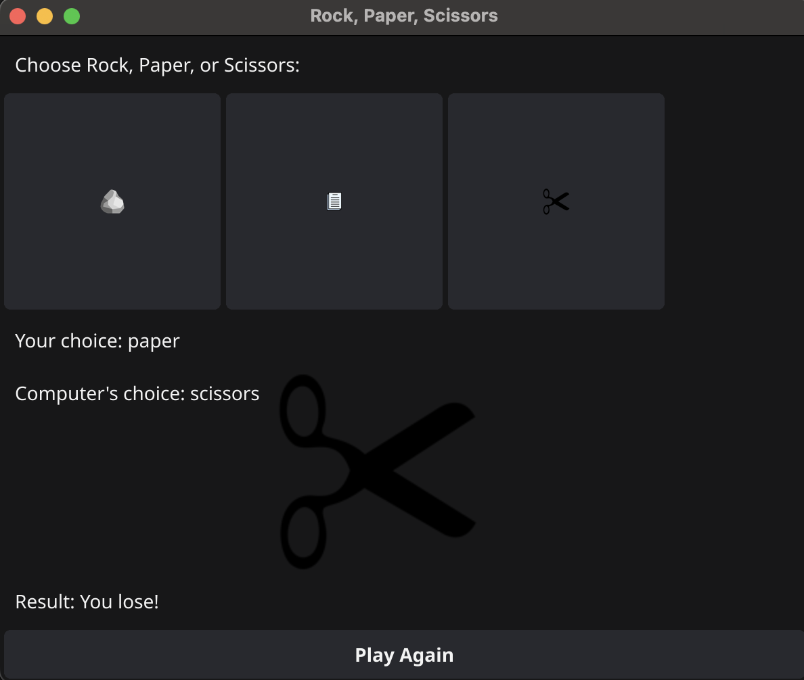

# Rock, Paper, Scissors 

This is a simple and fun desktop Rock, Paper, Scissors game I built for a class project. I built it in Go using the [Fyne GUI toolkit](https://developer.fyne.io/) and the [Beep audio package](https://github.com/faiface/beep). It includes custom icons for each choice and plays sound effects when you win or lose!

---

## Preview



---

## Features

- Playable GUI with clickable buttons for rock, paper, and scissors.
- Displays player and computer choices with images.
- Randomized computer moves.
- Win/loss detection and result message.
- Fun sound effects for wins and losses (`win.wav` and `lose.wav`).
- “Play Again” button to restart the game.

---

## Built With

- **Go** (Golang)
- **Fyne** for GUI components
- **Beep** for playing `.wav` sound files
- Custom assets: `rock.png`, `paper.png`, `scissors.png`, `win.wav`, `lose.wav`

---

## Dependencies

```bash
go mod tidy
